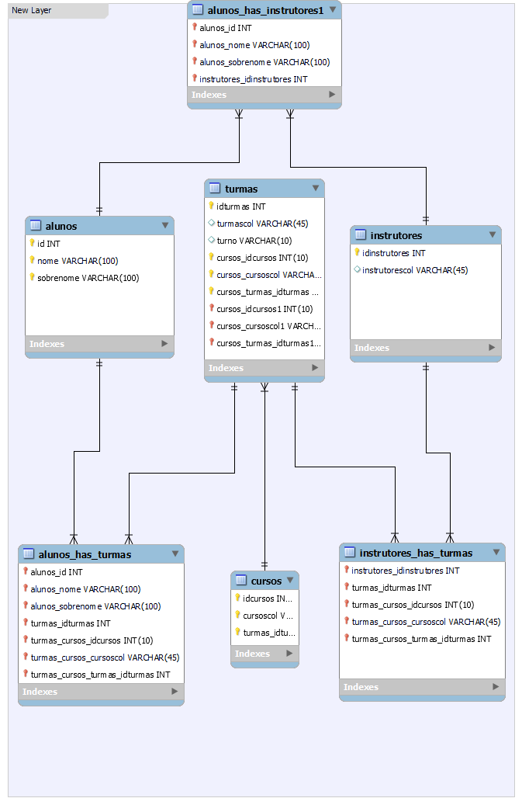

# NovoSistemaResilia_M4

 


## Existem outras entidades além dessas três?

```sh
Sim, Foi inserida a entidade Instrutores.
```

## Quais são os principais campos e tipos?

```sh
Os principais campos de cada entidade são: ID que utiliza o tipo SMALLINT e nome que utiliza VARCHAR(100)  
```

## Como essas entidades estão relacionadas?

```sh
a
```
